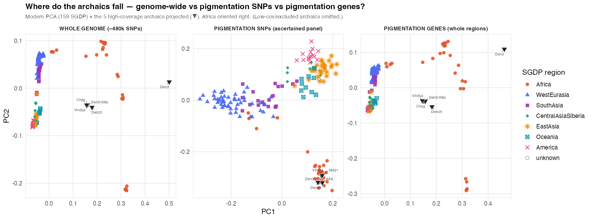

## The question

Pigmentation is under selection and its genetics need not track genome-wide ancestry. So: if we place the archaic hominins (Neanderthals, Denisovans) relative to modern human structure, do they fall in the **same** place when we use the whole genome as when we use only pigmentation loci?

## The method — build on moderns, project the ancients (both spaces)

For **both** the whole genome and the pigmentation panel we do the *same* two steps:

1. **Build the PCA on the 159 modern SGDP genomes only.** The archaics are gappy and highly divergent; if we threw them into the PCA they would define their own axis and distort the modern structure. Building on moderns keeps the axes interpretable (they *are* modern human structure).
2. **Project each archaic onto that modern basis.** We read the modern PCA's per-allele loadings and score each archaic against them.

Concretely, with `plink2`:

```bash
# 1. modern basis (per-allele loadings + reference allele counts)
plink2 --bfile MODERNS --freq counts --pca 10 allele-wts --out modpca
# 2. project the archaics onto it
plink2 --bfile ARCHAICS --read-freq modpca.acount \
  --score modpca.eigenvec.allele <id-col> <a1-col> header-read \
  no-mean-imputation variance-standardize --score-col-nums <PCs> --out arc_proj
```

- `variance-standardize` standardizes each SNP by the **modern** allele frequency (so the archaic sits on the modern axes' scale), `no-mean-imputation` **drops** a missing archaic genotype rather than filling it with the reference mean (so gaps don't drag a sample toward a false centre).
- We build one **combined** moderns+archaics dataset first, so variant IDs and allele coding are identical across the two — otherwise the archaic calls (which carry `ALT='.'` at most sites) never match the moderns by ID. Full runnable recipe: [`code/project_archaics.slurm`](https://github.com/lasisilab/sepia/blob/main/code/project_archaics.slurm).

**Validation.** Before trusting the archaic scores, we score the *moderns* with their own weights and confirm it reproduces their PCA — here |r| = 1.00, so the projection is faithful. (The sign comes out flipped between `--pca` and `--score`, so we take the moderns from their own self-projection too, to keep both on one convention.)

```{r setup, message=FALSE, warning=FALSE}
library(ggplot2)
have <- all(file.exists(file.path("output/projections",
  c("wg_after_modern.tsv","wg_after_archaic.tsv","pig_after_modern.tsv","pig_after_archaic.tsv"))))
```

```{r not-ready, eval=!have, echo=FALSE, results='asis'}
cat("> Projection coords not present yet — run `code/project_archaics.slurm`.\n")
```

## Where the archaics land

```{r land, eval=have, message=FALSE}
rd <- function(f) read.delim(file.path("output/projections", f), stringsAsFactors = FALSE)
hicov <- c("Chagyrskaya8","Denisova3","Denisova25","Denisova5","Vi33.19")
summ <- function(space) {
  m <- rd(paste0(space, "_after_modern.tsv")); a <- rd(paste0(space, "_after_archaic.tsv"))
  a <- a[is.finite(a$PC1), ]
  data.frame(space = space,
             modern_PC1_range = sprintf("%.2f to %.2f", min(m$PC1), max(m$PC1)),
             hicov_archaic_PC1 = sprintf("%.2f (mean)", mean(a$PC1[a$IID %in% hicov])),
             n_modern = nrow(m), n_archaic = nrow(a))
}
knitr::kable(rbind(summ("wg"), summ("pig")),
             caption = "Modern PC1 span vs where the high-coverage archaics project.")
```

- **Whole genome:** the high-coverage archaics sit at the **edge of the modern cloud, near the non-African side / origin** — *not* out among the (widely spread) African samples. That is the expected position for a divergent **outgroup**: a modern PCA has no axis that "contains" a lineage that split before modern humans diversified, so projection places it at the rim. (The ~2% Neanderthal ancestry in non-Africans is real but far too subtle to move a PC1 projection — that is an f/D-statistic question, not a PCA one.)
- **Pigmentation:** the archaics fall **in with the African samples.**

## The figure


## Reading it — what it means, and what it does *not*

The contrast is the result: **pigmentation does not recapitulate genome-wide ancestry.** But the "archaics cluster with Africans in pigmentation" panel must be read carefully:

- The pigmentation panel is **GWAS-ascertained** (variants discovered largely in European-ancestry cohorts), and at most of these loci the *derived* allele is the **out-of-Africa light-skin** variant. Archaics predate that evolution, so they carry the **ancestral state** — the same state that African populations (which never underwent out-of-Africa depigmentation) largely retain.
- So "archaics ≈ Africans" here is mostly **shared ancestral alleles at ascertained SNPs**, *not* a claim that archaics were phenotypically like modern Africans. Neanderthals are known to have carried *independently-derived* light-pigmentation alleles too (e.g., an MC1R loss-of-function variant).
- A PCA is a coarse summary; the actual phenotype question needs the functional-marker models (HIrisPlex-S, item B4), not a projection.

## The decisive check — whole gene regions vs the SNP panel

The analysis above leans on a specific **ascertained SNP panel**. To test whether "archaics with Africans" is real or a panel artifact, we ran the *same* recipe on **all variation across the 1,004 pigmentation-gene regions** (gene body ±10 kb; ~17,500 LD-pruned, unascertained variants — the gene network, not hand-picked SNPs; [`code/gene_region_pca.slurm`](https://github.com/lasisilab/sepia/blob/main/code/gene_region_pca.slurm), built from [`data/pigment_gene_map.tsv`](https://github.com/lasisilab/sepia/blob/main/data/pigment_gene_map.tsv)).



**Result.** The whole-genome and pigmentation-**gene-region** panels are **near-identical** — archaics project as a divergent **outgroup** at the non-African edge (high-coverage PC1 ≈ 0.15, matching to two decimals). Only the pigmentation-**SNP** panel places archaics with Africans.

**Interpretation — genes = ancestry, ascertained SNPs = selection.** Pigmentation *genes* carry ordinary genome-wide ancestry: any decent unascertained genomic sample recovers the same population structure, so the gene-region PCA ≈ the whole genome. What makes the SNP panel different is that it is **enriched for the selected, derived (out-of-Africa light-skin) alleles** — there archaics (ancestral) line up with the Africans who also retain the ancestral state. So the pigmentation-SNP "archaics with Africans" is the **footprint of selection at hand-picked loci**, not a pigmentation-gene ancestry signal. Real and phenotype-relevant, but read as *shared ancestral alleles at light-skin loci*, not as ancestry.

**The African samples fan out in two tiers** (the expected human-diversity hierarchy): the **KhoeSan** — **Ju/'hoan** (×3) and **Khomani San** (×2) — are the earliest-splitting human lineage, so they occupy their **own axis** (they sit alone in a cleanly separated cluster, well off on PC2). The Central African rainforest hunter-gatherers **Mbuti** and **Biaka** are divergent along **PC1** (the African end of the African–non-African axis) but cluster with the other Africans on PC2 — *not* down with the KhoeSan. North Africans (Mozabite, Saharawi) sit nearest the non-Africans (Eurasian admixture). In the pigmentation-SNP panel these deep-African groups pull toward the archaics because they retain the most ancestral pigmentation alleles. *(One sample, `LP6005441-DNA_A09`, shows as "unknown" — its library ID is missing from `data/sgdp_metadata.tsv`; a metadata gap to fill, not a data problem.)*

## Next
- **HIrisPlex-S phenotype prediction (B4)** — the functional markers + published weights for the actual "what did they look like" question (a PCA projection speaks to genetic relationships, not phenotype).
- Optionally quantify the genome-wide archaic position with **f/D-statistics** if the Neanderthal-admixture lean is of interest (PCA is too coarse for it).
