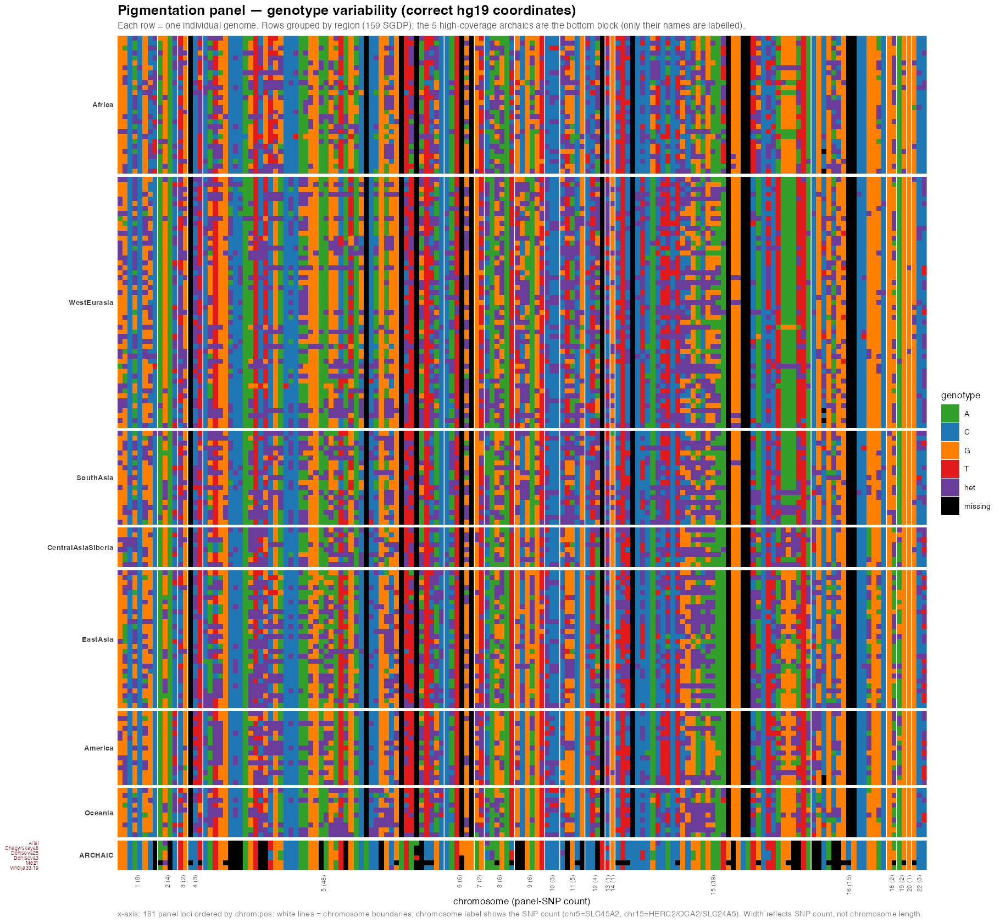
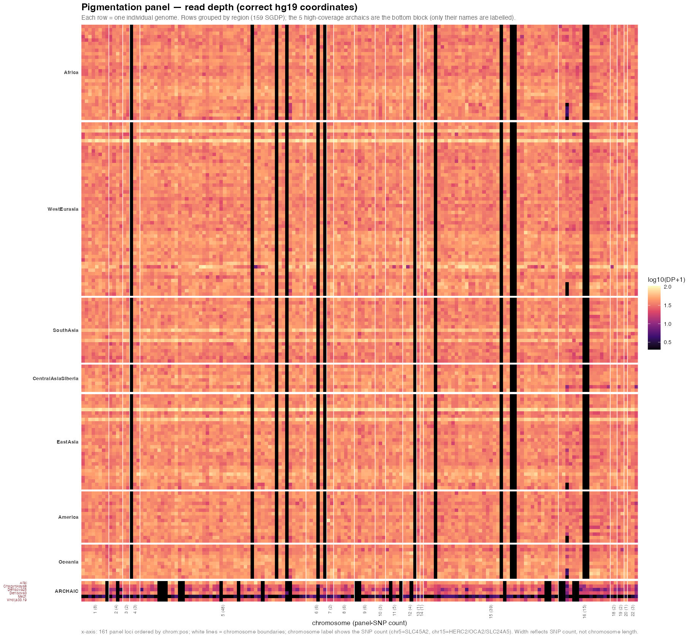

## The question

Before trusting any pigmentation result, we need to know the panel is actually *covered*:
at each of the panel SNPs, how deep is the sequencing, where are the gaps, and what genotypes
do the samples carry? This is the QC-minded half of Lily's thesis — the coverage/depth arm.

## Why the thesis figures needed repair

The thesis depth and missingness figures measured the 222 panel SNPs at their **hg38**
positions inside **hg19** data — the same build mismatch (bug A2) that collapsed the
pigmentation PCA. The result is ~292 kb off-target: the depth was read at coordinates that
are *near* the intended SNPs but not on them (e.g. SLC24A5 was measured at `15:48134288`, its
hg38 position, instead of the true hg19 `15:48426484`). So the old heatmaps look reasonable
but describe the wrong genome positions, and they covered the archaics only.

Here we read the **same panel at the correct hg19 coordinates**, from the repaired B2a
extraction, and across **moderns *and* archaics** — 161 variable panel loci × 164 samples
(159 SGDP, all fully public, + the 5 high-coverage archaics). Substrate + code:
[`output/panel_matrix/`](https://github.com/lasisilab/sepia/tree/main/output/panel_matrix),
[`code/export_panel_matrix.sh`](https://github.com/lasisilab/sepia/blob/main/code/export_panel_matrix.sh),
[`plan/figures/make_panel_heatmaps.R`](https://github.com/lasisilab/sepia/blob/main/plan/figures/make_panel_heatmaps.R).

## Genotype variability (Lily's #2)

Each cell is a sample's genotype at a panel SNP: homozygotes coloured by base (A/C/G/T),
heterozygotes purple, and **missing calls black** — the "missing = black" view, now with the
absolute-base colouring. Solid columns are monomorphic loci; mixed columns are the variable,
informative ones. The archaic rows (bottom) carry the missing cells where those genomes lack
a call.

## Read depth, by chromosome (Lily's #1 & #3)

Per-sample read depth at each panel SNP, log-scaled, **faceted by chromosome** (the
"break the x-axis by chromosome" view). The 159 moderns are uniformly high-coverage (light);
the 5 high-coverage archaics form the darker, more variable band at the bottom, with genuine
missing positions in black. This is the corrected depth heatmap: right coordinates, and now
including the modern reference alongside the archaics.

## Reading it — and what is still open

- **The moderns are essentially fully covered** at the panel; the coverage question is really
  about the archaics, and there the depth is lower and patchier — exactly why the confidence
  models (binomial consensus accuracy + the Monte-Carlo damage-decay simulation) matter for
  archaic genotype calls.
- **Chagyrskaya 8 is absent** here (5 high-coverage archaics, not 6): its `.noRB` VCF extracts
  zero records — a known bug still to fix.
- **The 3 low-coverage archaics** (Denisova 11, Goyet, Les Cottés) are BAM-only, so they are
  not in this VCF-derived matrix; their panel depth comes from a separate `samtools depth`
  pass on the BAMs (in progress) and will extend the archaic rows.
- A genome-wide depth **background** (to compare the panel depth against the rest of the
  genome) is the natural next layer, from the same BAMs.

## Next
- Add the low-coverage archaics' panel depth from their BAMs.
- Fix the Chagyrskaya `.noRB` extraction so all 6 high-coverage archaics appear.
- Fold in the confidence models (binomial + Monte Carlo) as the per-call reliability layer on
  top of this depth.
